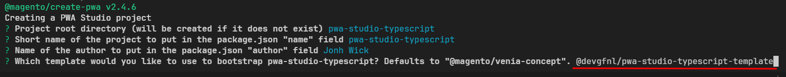

# PWA Studio Typescript Template

This repository provides a PWA Studio TypeScript template to help you quickly set up a PWA Studio project using TypeScript.

## Table of Contents
- [Features](#features)
- [Prerequisites](#prerequisites)
- [How to Use](#how-to-use)
  - [Run the Scaffolding Tool](#run-the-scaffolding-tool)
- [Contributing](#contributing)
- [License](#license)

## Features
- TypeScript support for PWA Studio
- Typed css modules

## Prerequisites
Before using this template, ensure you have the [minimum requirements for using PWA Studio](https://developer.adobe.com/commerce/pwa-studio/tutorials/#minimum-requirements).

## How to Use

### Run the Scaffolding Tool

To use this template, follow these steps. This example uses Yarn to create a new project:

1. **Run the scaffolding command:**
    ```bash
    yarn create @magento/pwa
    ```

2. **Specify the template:**

    When prompted the question to specify the template, copy and paste the following template package:
    ```
    @devgfnl/pwa-studio-template-typescript
    ```

    Your terminal should look something like this:
    

3. **Continue with the installation:**

    If the template selected in the terminal output matches the screenshot above, you can proceed with the installation by following the on-screen instructions.
